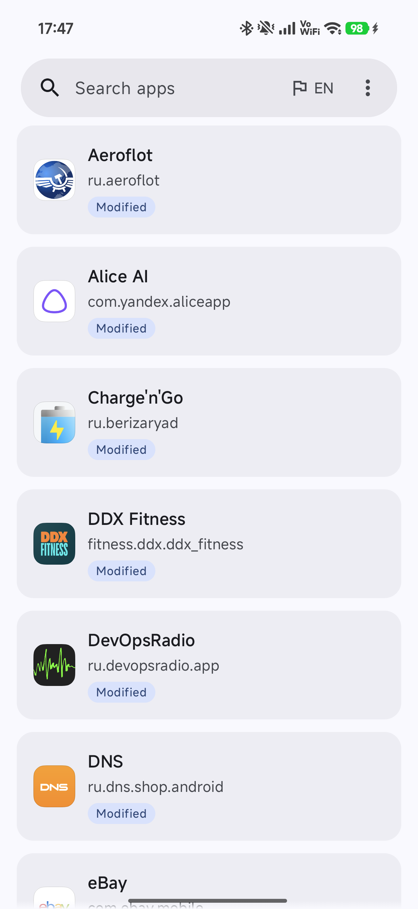
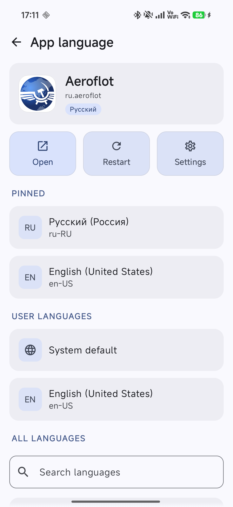
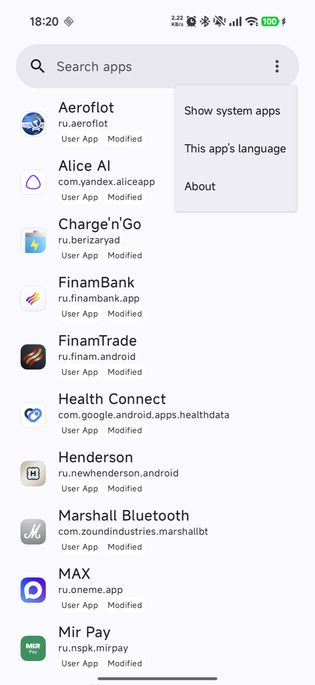
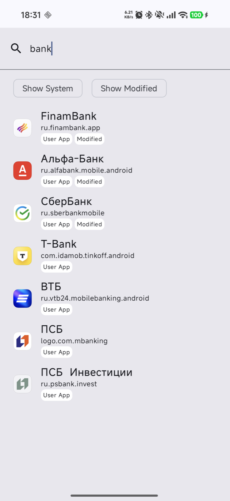
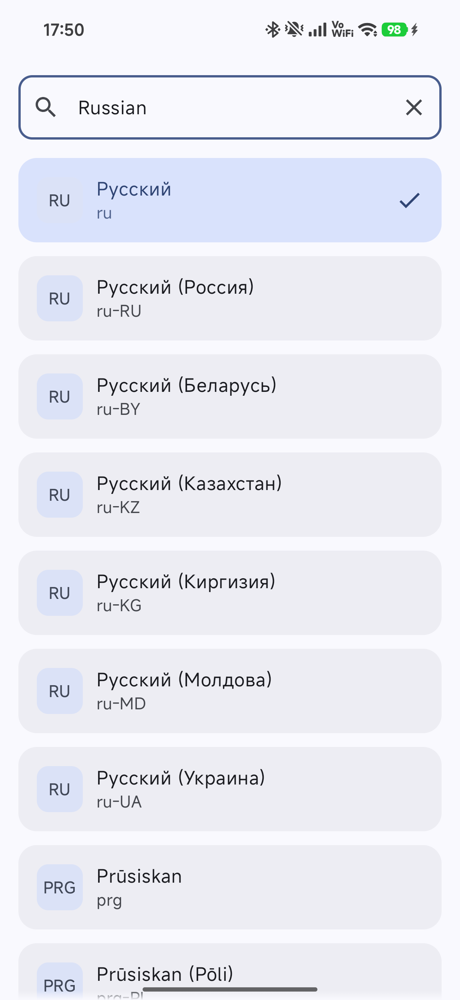
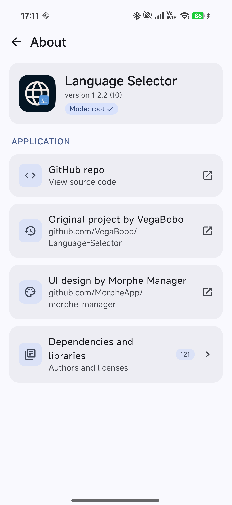

### Language Selector

[Русская версия](README.ru.md) · [Website](https://vaas1k.github.io/Language-Selector/)

Set a different language for any app on Android 13+, the same way the system "App languages" screen does, but for every app, including ones that don't list themselves there.

<div>






</div>

### How it works

Android 13+ can give every app its own language, separate from the system one. The system service `LocaleManagerService` stores that setting, but changing it for another app needs shell or root privileges (`cmd locale set-app-locales`). Stock Android exposes it in Settings; some ROMs (MIUI/HyperOS and others) hide the entry or do not ship it at all.

Language Selector is a front end for that one system call:

1. It starts a privileged helper process (via root or Shizuku) that holds a binder to the hidden `ILocaleManager`.
2. It lists the installed apps and marks the ones that already have an overridden locale.
3. A tap calls `setApplicationLocales(package, user, locales)`. The system sends the app a configuration change and it redraws in the new language, if it ships that translation. Language Selector translates nothing itself.
4. It can reset an app to the system language, pin the languages you use most, and cycle through them from a Quick Settings tile for whatever app is on screen.

### Requirements

- Android 13 or newer.
- Root (KernelSU, Magisk or APatch) **or** [Shizuku](https://shizuku.rikka.app/) (one of the latest two releases). See [Setup](#setup).

### Install

- **GitHub Releases.** Download `language-selector-X.Y.Z.apk` from [the latest release](https://github.com/vaas1k/Language-Selector/releases/latest). Each release has `SHA256SUMS` and a VirusTotal link. Signing certificate SHA-256, check with `apksigner verify --print-certs language-selector-X.Y.Z.apk`:
  `D0:8A:A0:A2:9B:A8:DB:44:E9:97:9A:75:1A:F2:1F:92:A3:38:19:55:DB:5E:69:F2:7E:EF:34:CA:83:CC:01:87`
- **Obtainium.** In [Obtainium](https://github.com/ImranR98/Obtainium) add `https://github.com/vaas1k/Language-Selector` as an app source; updates follow release tags.

Google Play Protect may warn about this APK, because it is installed outside Google Play from a developer it does not know, and the app uses privileged APIs (root/Shizuku), which also triggers warnings. To verify the file, compare the APK's SHA-256 with `SHA256SUMS` in the release, check the signing certificate SHA-256 above and the VirusTotal link in the release notes. Then choose "Install anyway".

You can also [build it yourself](#building). The package id is `dev.vaas1k.languageselector`, so it installs next to the upstream app, not over it.

### Setup

Pick one of the two options. The loading screen shows which one is in use, and About shows it as "Mode: root" or "Mode: Shizuku (uid N)".

#### Option A – root (KernelSU / Magisk / APatch)

1. Grant root to Language Selector in your root manager.
   - KernelSU: open the **Superuser** tab and turn on the toggle next to Language Selector. KernelSU shows no prompt, so without this step the app has no root.
     KernelSU drops the grant when the app is reinstalled or gets a new uid (e.g. switching from a test build to the release), so turn the toggle on again after that.
   - APatch: same, in the **Superuser** tab.
   - Magisk: tap **Grant** in the prompt on first launch.
2. Open Language Selector. The loading screen says "Root access granted" and the app list appears.

Shizuku is not needed in this mode.

#### Option B – Shizuku without root

1. Install [Shizuku](https://shizuku.rikka.app/).
2. Enable Developer options (Settings → About phone → tap the build number 7 times), then turn on **Wireless debugging** in Developer options.
3. In Shizuku tap **Start via Wireless debugging**. The first time, pair Shizuku with the code shown in Wireless debugging (Shizuku guides you through it); later starts need no pairing.
4. Open Language Selector, tap **Proceed**, then **Allow** in the Shizuku dialog. The loading screen says "Shizuku connected".

In this mode Shizuku stops on every reboot: start it again from the Shizuku app (step 3) before using Language Selector or its tile.
Shizuku also forgets the permission when Language Selector is reinstalled: tap Proceed and Allow again.

The Quick Settings tile works in both modes and cycles through your pinned languages.

### Usage

1. Open the app. It connects with root or Shizuku as described in [Setup](#setup).
2. Pick an app. Apps with a changed language are marked **Modified** and listed first. The search bar finds apps by name or package; before you type it shows recently opened apps (**History**), and the **Show System** / **Show Modified** chips filter the results. ⋮ → **Show system apps** adds system apps to the main list.
3. The app screen shows the current language and three buttons: **Open** launches the app, **Restart** force-stops and relaunches it, **Settings** opens its system App info page.
4. Pick a language. **Pinned** comes first, then **User languages** (**System default** and the languages from your system settings), then **All languages**. Tapping a language in All languages opens its regions: the plain language first, then its main region, then the rest by name. **Search languages** finds a language or region by its own name, its name in the UI language or its tag (`ru-RU`). The current language has a check mark.
5. If the app still shows the old language, tap **Restart**.

**Pinning.** Long-press a language to pin or unpin it. Russian (Russia) and English (United States) are pinned by default.

**Quick Settings tile.** Add the "Language Selector" tile. Tapping it cycles the foreground app through your pinned languages. With no pinned languages the tile shows Unavailable; system apps are skipped.

**This app's language.** The button next to ⋮ in the search bar (flag icon and the two-letter code of the current UI language: EN, RU or ZH) opens the system per-app language screen for Language Selector itself. The UI is available in English, Russian and Chinese (Simplified).

**About.** ⋮ → **About** shows the version and the connection mode, links to the source code, the original project and Morphe Manager, and **Dependencies and libraries** with their authors and licenses.

Language Selector does not translate anything: it only tells an app which locale to use. If the app has no resources for that language, you get its default. Changing the language of system apps can misbehave and is not recommended.

### Building

Requirements on Linux, macOS or Windows:

1. JDK 21 (Temurin, Microsoft, or `brew install openjdk@21` / `apt install openjdk-21-jdk` / `winget install EclipseAdoptium.Temurin.21.JDK`).
2. Android SDK: the simplest is Android Studio (it installs the SDK and sets `local.properties`). Without Studio, install the [command line tools](https://developer.android.com/studio#command-line-tools-only), then:
   ```
   sdkmanager --licenses
   sdkmanager "platforms;android-37" "build-tools;36.0.0" "platform-tools"
   ```
   and create `local.properties` in the project root with `sdk.dir=/path/to/android-sdk` (on Windows escape backslashes: `sdk.dir=C\:\\Android\\sdk`).
3. Build:
   ```
   ./gradlew :app:testDebugUnitTest :app:assembleDebug     # Linux/macOS
   gradlew.bat :app:testDebugUnitTest :app:assembleDebug   # Windows
   ```
   Output: `app/build/outputs/apk/debug/app-debug.apk`. Install with `adb install -r <apk>`.

If Gradle picks the wrong JDK, set `JAVA_HOME` to the JDK 21 directory or add `org.gradle.java.home=<path>` to `gradle.properties`.

Release builds (`:app:assembleRelease`) are signed with the key described in `keystore.properties` (`storeFile`, `storePassword`, `keyAlias`, `keyPassword`); without that file the debug key is used. CI builds a signed release for every `v*` tag.

Notes for coding agents are in `AGENTS.md`.

### Credits and license

Fork of [VegaBobo/Language-Selector](https://github.com/VegaBobo/Language-Selector) by VegaBobo, who wrote the original app. This fork fixes list scrolling, adds root support next to Shizuku, a resilient service connection, QS tile fixes, a Restart button, a Russian UI and a themed icon, a new UI ported from Morphe Manager with region lists and language search, and targets Android 13+.

Licensed under [GPL-3.0-or-later](LICENSE). Thanks to [VegaBobo](https://github.com/VegaBobo/Language-Selector) for the original app (Apache-2.0, see [LICENSE.apache](LICENSE.apache)) and to [Morphe Manager](https://github.com/MorpheApp/morphe-manager) for the UI design and ported components (GPL-3.0 with additional terms, see [LICENSE](LICENSE)).
