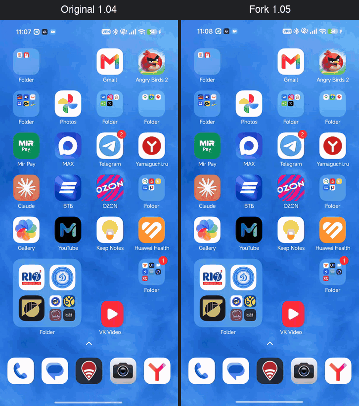
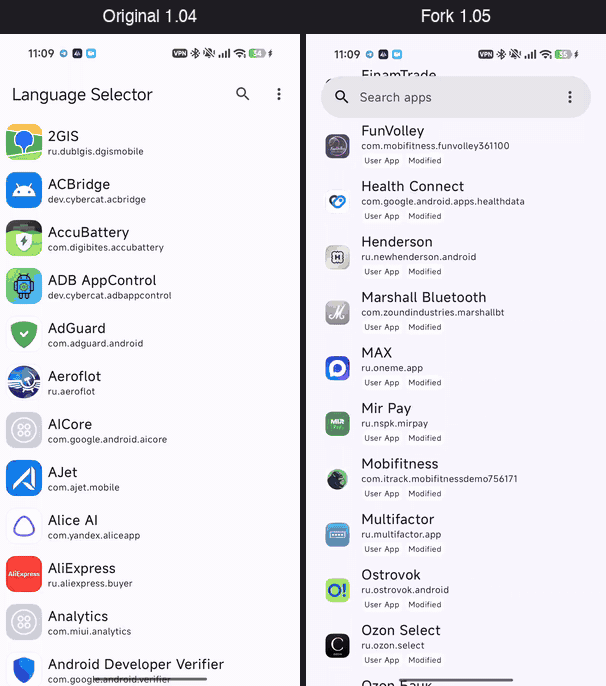
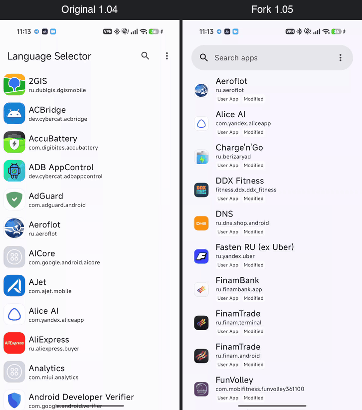

### Language Selector

[English version](README.md) · [Сайт](https://vaas1k.github.io/Language-Selector/)

Отдельный язык интерфейса для любого приложения на Android 13+. Работает как системный экран "Язык приложений", только для всех приложений, в том числе тех, которых в этом списке нет.

<div>


</div>

### Было / стало

Оригинал 1.04 (слева) и этот форк 1.05 (справа), один телефон, одинаковый ввод.

Холодный старт. Первый кадр у обоих примерно через 0,1 с; форк показывает статус root/Shizuku во время загрузки и ставит изменённые приложения первыми.



Шесть быстрых свайпов. 99-й перцентиль времени кадра: 200 мс у оригинала, 10 мс у форка (dumpsys gfxinfo).



Ввод "ban": оригинал фильтрует список примерно через 2,4 с, форк – в том же кадре.


Экран приложения: в форке есть закреплённые языки и кнопка "Перезапуск".



### Как это работает

В Android 13+ у каждого приложения может быть свой язык, отличный от системного. Хранит эту настройку системный сервис `LocaleManagerService`, но менять её для чужого приложения можно только с правами shell или root (`cmd locale set-app-locales`). На стоковом Android пункт есть в настройках, а на части прошивок (MIUI/HyperOS и другие) он спрятан или отсутствует.

Language Selector – фронтенд к этому одному системному вызову:

1. Поднимает привилегированный процесс (через root или Shizuku), который держит binder на скрытый `ILocaleManager`.
2. Показывает список установленных приложений и помечает те, у которых локаль уже переопределена.
3. По тапу вызывает `setApplicationLocales(package, user, locales)`. Система отправляет приложению config change, и оно перерисовывается на новом языке, если у него есть такой перевод. Сам Language Selector ничего не переводит.
4. Умеет вернуть системный язык, закрепить частые языки и переключать их по кругу плиткой в шторке для приложения на экране.

### Что нужно

- Android 13 или новее.
- Root (KernelSU, Magisk или APatch) **или** [Shizuku](https://shizuku.rikka.app/) (одна из двух последних версий). См. [Настройка](#настройка).

### Установка

- **GitHub Releases.** Скачайте `app-release.apk` из [последнего релиза](https://github.com/vaas1k/Language-Selector/releases/latest). В каждом релизе есть `SHA256SUMS` и ссылка на VirusTotal. SHA-256 сертификата подписи, проверка – `apksigner verify --print-certs app-release.apk`:
  `D0:8A:A0:A2:9B:A8:DB:44:E9:97:9A:75:1A:F2:1F:92:A3:38:19:55:DB:5E:69:F2:7E:EF:34:CA:83:CC:01:87`
- **Obtainium.** В [Obtainium](https://github.com/ImranR98/Obtainium) добавьте источник `https://github.com/vaas1k/Language-Selector`, обновления приходят по тегам релизов.
- **IzzyOnDroid.** Появится после первого релиза в [репозитории IzzyOnDroid](https://apt.izzysoft.de/fdroid/), ставить через Droid-ify или Neo Store.

Можно и [собрать самому](#сборка). Идентификатор пакета – `dev.vaas1k.languageselector`, поэтому приложение ставится рядом с оригиналом, а не поверх него.

### Настройка

Подойдёт любой из двух вариантов. Экран загрузки показывает, какой из них используется, а в разделе "О приложении" написано "Режим: root" или "Режим: Shizuku (uid N)".

#### Вариант A – root (KernelSU / Magisk / APatch)

1. Выдайте Language Selector root в своём менеджере.
   - KernelSU: на вкладке **Суперпользователь** включите переключатель у Language Selector. KernelSU сам ничего не спрашивает, так что без этого шага root у приложения не будет.
     KernelSU сбрасывает разрешение при переустановке приложения или смене его uid (например, при переходе с тестовой сборки на релиз), после этого включите переключатель снова.
   - APatch: так же, на вкладке **Суперпользователь**.
   - Magisk: при первом запуске нажмите **Предоставить** в запросе.
2. Откройте Language Selector. На экране загрузки появится "Root-доступ получен", затем список приложений.

Shizuku в этом режиме не нужен.

#### Вариант B – Shizuku без root

1. Установите [Shizuku](https://shizuku.rikka.app/).
2. Включите режим разработчика (Настройки → О телефоне → 7 раз нажмите на номер сборки) и в параметрах разработчика включите **Отладку по Wi-Fi**.
3. В Shizuku нажмите **Запуск через отладку по Wi-Fi**. В первый раз Shizuku нужно сопрячь по коду из экрана отладки по Wi-Fi (Shizuku подскажет, как); дальше сопряжение не требуется.
4. Откройте Language Selector, нажмите **Продолжить**, затем **Разрешить** в окне Shizuku. На экране загрузки появится "Shizuku подключён".

В этом режиме Shizuku останавливается при каждой перезагрузке: перед работой с Language Selector или его плиткой снова запустите его в приложении Shizuku (шаг 3).
Shizuku также забывает разрешение при переустановке Language Selector: нажмите Продолжить и Разрешить ещё раз.

Плитка в быстрых настройках работает в обоих режимах и переключает закреплённые языки.

### Как пользоваться

1. Откройте приложение. Оно подключится через root или Shizuku, как описано в разделе [Настройка](#настройка).
2. Выберите приложение. Есть поиск с историей запросов, а через ⋮ → **Показать системные** видны и системные приложения.
3. Выберите язык. Сверху идут **Закреплённые** и **Языки пользователя**, ниже – **Все языки**.
4. Если приложение не сменило язык, нажмите **Перезапуск**: оно будет остановлено и запущено заново.

**Закрепление.** Долгое нажатие на язык закрепляет его или открепляет. По умолчанию закреплены русский (Россия) и английский (США).

**Плитка в быстрых настройках.** Добавьте плитку "Language Selector": нажатие переключает открытое сейчас приложение по кругу между закреплёнными языками. Если закреплённых языков нет, плитка неактивна; системные приложения она не трогает.

**Язык самого приложения.** ⋮ → **Язык этого приложения** открывает системный экран выбора языка для Language Selector. Интерфейс переведён на русский, английский, японский, португальский (Бразилия) и китайский (упрощённый).

Language Selector ничего не переводит, он лишь сообщает приложению, какую локаль использовать. Если нужного языка в приложении нет, останется язык по умолчанию. Менять язык системным приложениям не стоит: они могут вести себя непредсказуемо.

### Сборка

Подходит Linux, macOS или Windows:

1. JDK 21 (Temurin, Microsoft или `brew install openjdk@21` / `apt install openjdk-21-jdk` / `winget install EclipseAdoptium.Temurin.21.JDK`).
2. Android SDK: проще всего поставить Android Studio (она установит SDK и создаст `local.properties`). Без Studio установите [command line tools](https://developer.android.com/studio#command-line-tools-only), затем:
   ```
   sdkmanager --licenses
   sdkmanager "platforms;android-37" "build-tools;36.0.0" "platform-tools"
   ```
   и создайте в корне проекта `local.properties` со строкой `sdk.dir=/path/to/android-sdk` (на Windows обратные слэши экранируются: `sdk.dir=C\:\\Android\\sdk`).
3. Сборка:
   ```
   ./gradlew :app:testDebugUnitTest :app:assembleDebug     # Linux/macOS
   gradlew.bat :app:testDebugUnitTest :app:assembleDebug   # Windows
   ```
   Результат: `app/build/outputs/apk/debug/app-debug.apk`, установка – `adb install -r <apk>`.

Если Gradle берёт не тот JDK, укажите `JAVA_HOME` на JDK 21 или добавьте `org.gradle.java.home=<path>` в `gradle.properties`.

Релизная сборка (`:app:assembleRelease`) подписывается ключом из `keystore.properties` (`storeFile`, `storePassword`, `keyAlias`, `keyPassword`); без этого файла используется отладочный ключ. CI собирает подписанный релиз на каждый тег `v*`.

Заметки для ИИ-агентов – в `AGENTS.md`.

### Авторы и лицензия

Форк [VegaBobo/Language-Selector](https://github.com/VegaBobo/Language-Selector); оригинальное приложение написал VegaBobo. В форке исправлена прокрутка списка, добавлен root наряду с Shizuku, устойчивое подключение к сервису, исправлена плитка, появились кнопка перезапуска, русский интерфейс и тематическая иконка; поддерживается Android 13+.

Лицензия – [Apache License 2.0](LICENSE).
